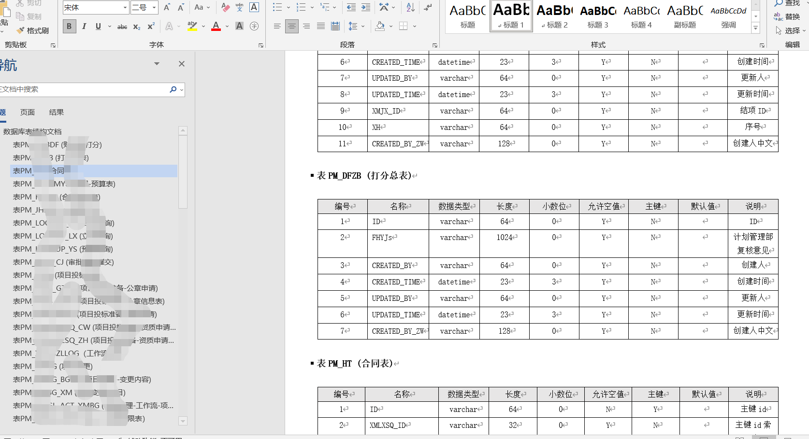

数据库文档生成工具
====
    简单配置，就能够生成数据库文档。

使用方法
----
    1.修改测试类SqlDocumentGenerationApplicationTests的数据库配置信息
    2.生成文件的格式可在测试类中修改
    3.支持mysql和sqlServer数据库,修改测试类中DriverClassName属性
    4.更具自己需求修改pom文件中plugins的configuration属性
    5.运行测试类中documentGeneration方法  
    

使用的框架
----
    1.spring boot  
    2.spring jdbc  
    3.screw-core  

支持的数据库
----
    1.mysql  
    2.sqlServer  

支持生成的文档类型
----
	1.word
	2.excel
	3.html

如何扩展已支持更多数据库
----
    1.修改测试类SqlDocumentGenerationApplicationTests的数据库配置信息
    2.修改pom文件中plugins的configuration的数据库配置信息

效果图
----

 